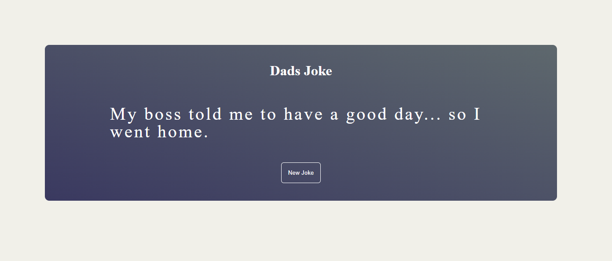

# Dad's Joke React App



A simple and fun React app that fetches and displays random dad jokes from the [icanhazdadjoke.com](https://icanhazdadjoke.com/) API. Built with React, TypeScript, and Vite.

## 🚀 Features

- Fetches a random dad joke from a public API
- Clean, modern UI with a gradient card
- "New Joke" button to fetch another joke instantly
- Responsive and minimal design

## 🖼️ Preview


## 🛠️ Getting Started

### Prerequisites
- [Node.js](https://nodejs.org/) (v16 or higher recommended)
- [npm](https://www.npmjs.com/) or [yarn](https://yarnpkg.com/)

### Installation

1. **Clone the repository:**
   ```bash
   git clone <repo-url>
   cd dadsjoke_react
   ```
2. **Install dependencies:**
   ```bash
   npm install
   # or
   yarn install
   ```

### Running the App

- **Development mode:**
  ```bash
  npm run dev
  # or
  yarn dev
  ```
  The app will be available at [http://localhost:5173](http://localhost:5173) (or as shown in your terminal).

- **Production build:**
  ```bash
  npm run build
  # or
  yarn build
  ```

- **Preview production build:**
  ```bash
  npm run preview
  # or
  yarn preview
  ```

## 📦 Project Structure

- `src/App.tsx` — Main app component
- `src/component/Joke.tsx` — Joke card and logic
- `src/component/Joke.css` — Styles for the joke card
- `public/image.png` — App preview image

## 📚 API Reference

- [icanhazdadjoke.com API](https://icanhazdadjoke.com/api)

## 🙋 **Author & Contact**

**Author:** Magesh Balram

📧 **Email:** [mageshbalram@gmail.com](mailto:mageshbalram@gmail.com)
